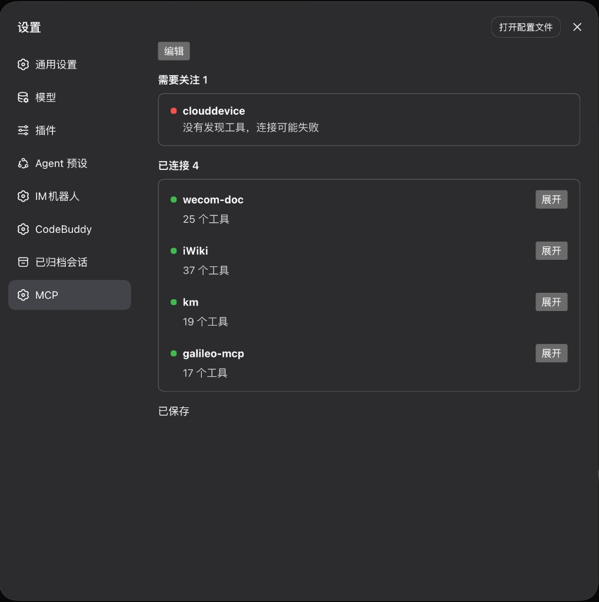
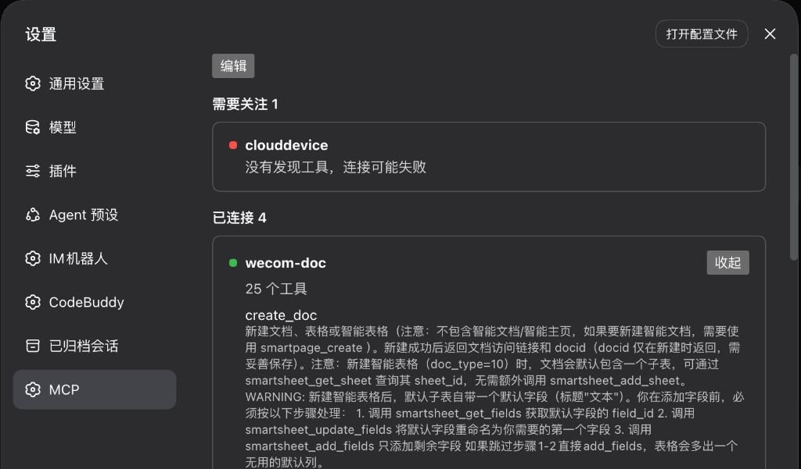
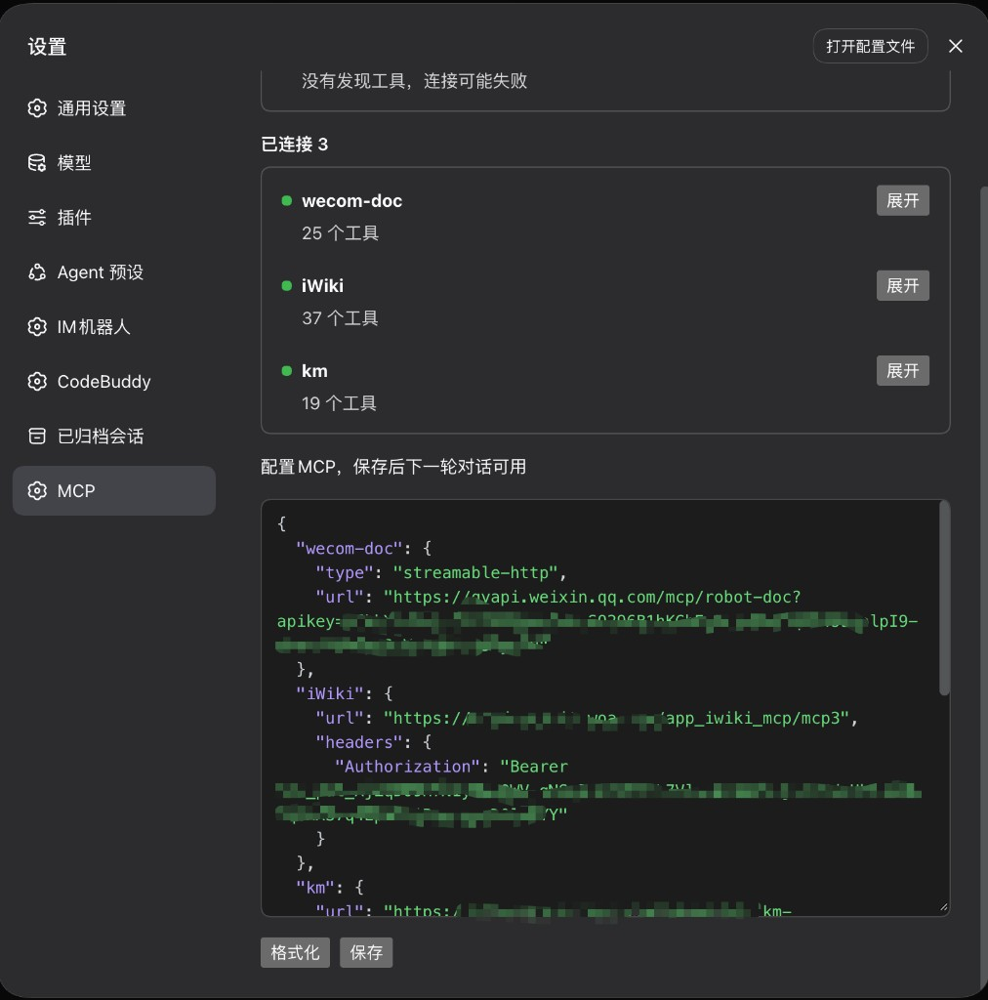

# dsh-mcp-setting

支持在 dsh Web 的设置页动态配置MCP服务器，并实时生效

## 能力概览

1. 查看服务器列表。绿点是已连接，红点是连接异常



2. 查看MCP工具与说明



3. JSON格式配置MCP（同cursor）



## 安装

在 deepseek-harness 仓库根目录先打包，再装进 Web profile：

```sh
node plugin/dsh-mcp-setting/build.mjs
pnpm dsh plugin --profile web add file:./plugin/dsh-mcp-setting
```

也可以直接装 GitHub 上的这份仓库：

```sh
pnpm dsh plugin --profile web add github:pipiduck17/dsh-mcp-setting
```

发布到 npm 之后可以按包名安装：

```sh
pnpm dsh plugin --profile web add @pipiduck/dsh-mcp-setting
```

启动时不要再加 `--patch`，否则会和装好的插件各挂一行：

```sh
pnpm dsh web
```

浏览器打开终端里打印的 `http://127.0.0.1:3080/?token=...`，进入 **设置 → MCP**。

改了源码之后要重新打包再装一次。`plugin add` 放进 profile 的是一份拷贝，不会跟着源码变。

## 调试

支持热更新调试。在 deepseek-harness 仓库根目录开两个终端：

```sh
pnpm dsh web --patch plugin/dsh-mcp-setting/dev.patch.yml
node plugin/dsh-mcp-setting/build.mjs --watch
```
